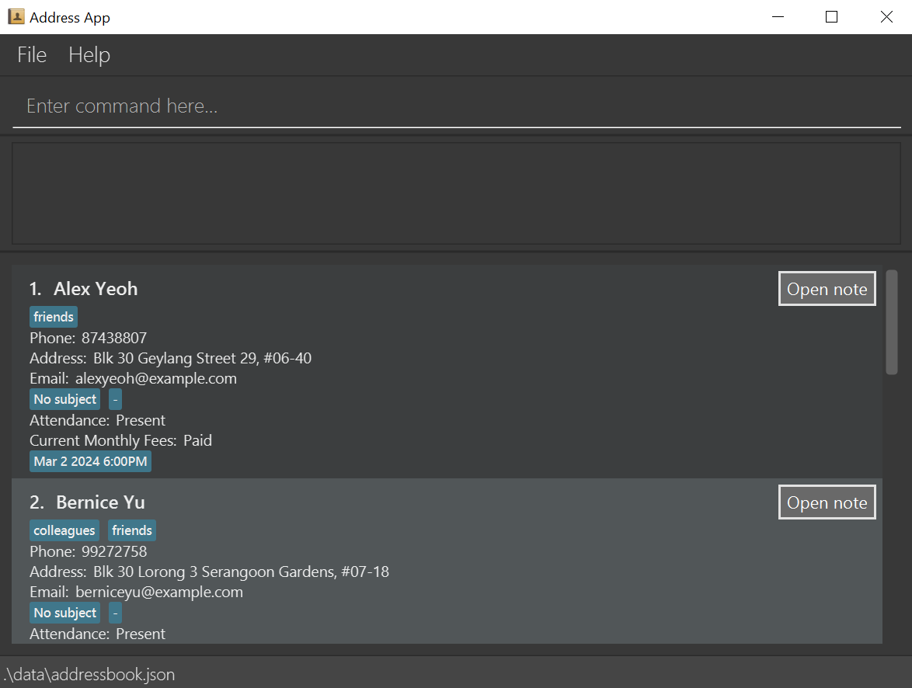
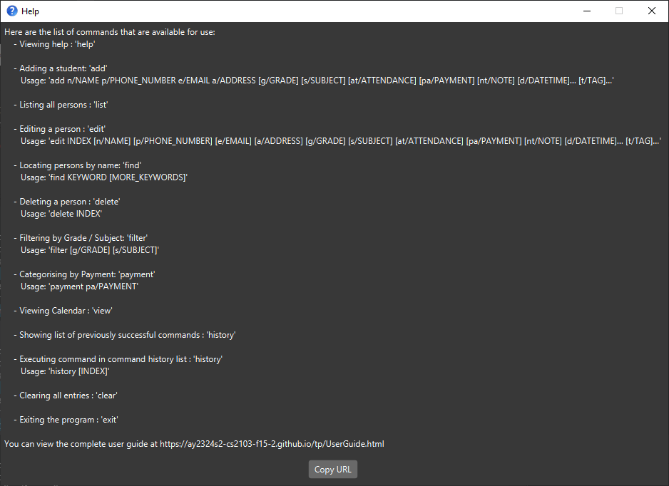
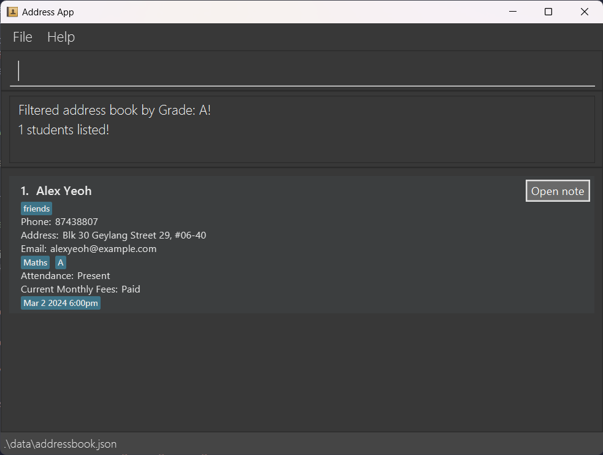
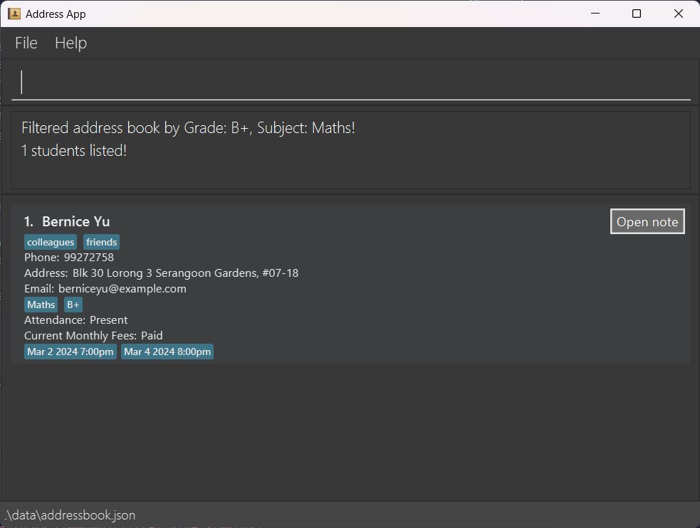
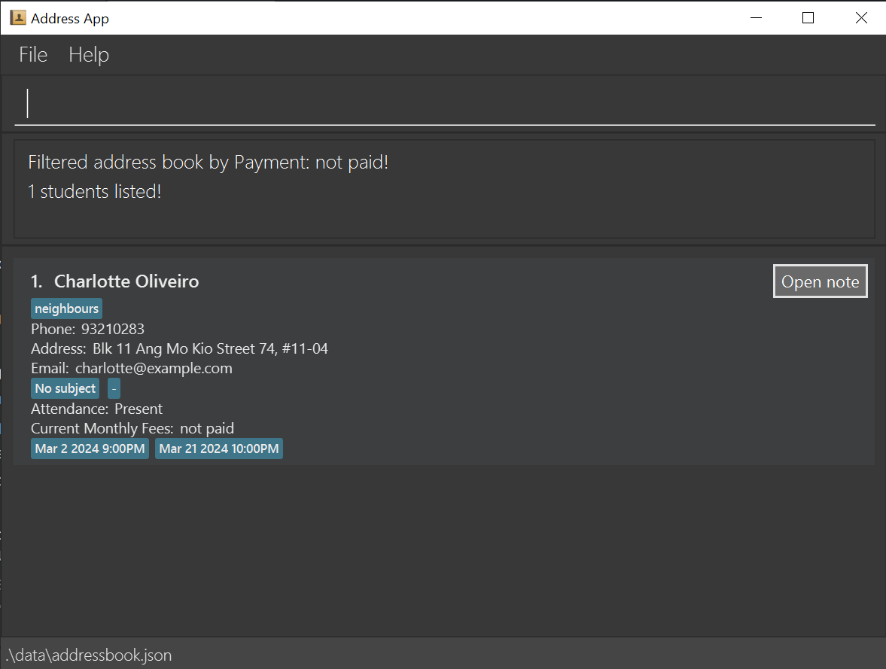
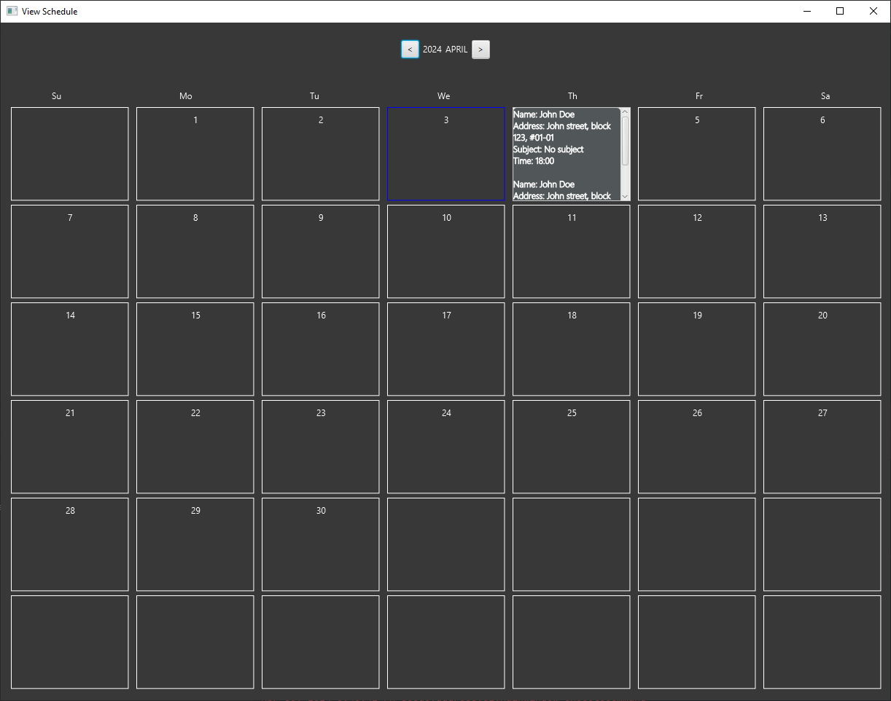
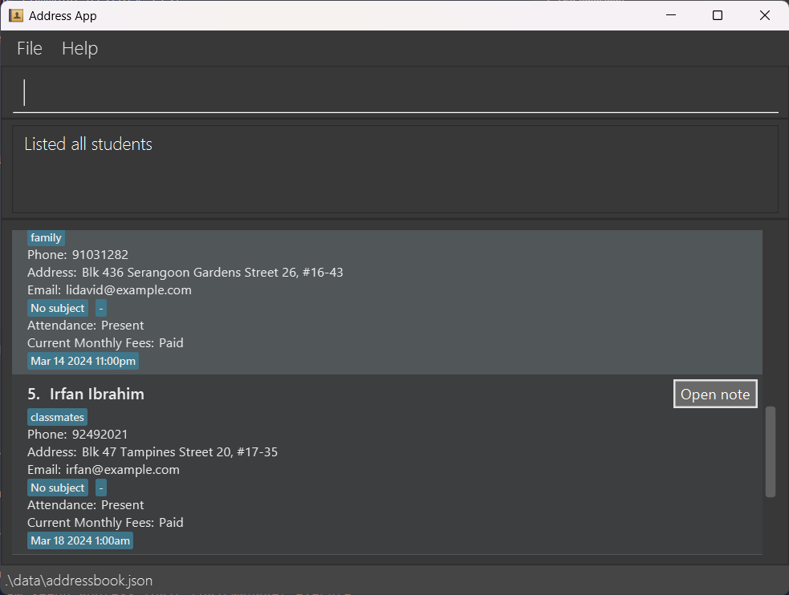

TutorsGo is a **desktop app for tutors to manage student details, optimized for use via a Command Line Interface** (CLI) while still having the benefits of a Graphical User Interface (GUI). If you can type fast, TutorsGo can get your contact management tasks done faster than traditional GUI apps.

* Table of Contents
{:toc}

--------------------------------------------------------------------------------------------------------------------

## Why TutorsGo?

* Calendar Integration: Seamlessly plan tutoring sessions with an integrated calendar view, enabling easy lookup of upcoming lessons and schedules.
* Comprehensive Student Profiles: Access student grades, subjects, notes and more at your fingertips, allowing for easy lookup of everything you need to know about your student.
* Payment Tracking Made Simple: Keep tabs on payments effortlessly, ensuring financial matters are organized and up-to-date.

## Quick start

1. Ensure you have Java `11` or above installed in your Computer.

1. Download the latest `.jar` from [here](https://github.com/AY2324S2-CS2103-F15-2/tp/releases).

1. Copy the file to the folder you want to use as the _home folder_ for your AddressBook.

1. Open a command terminal, `cd` into the folder you put the jar file in, and use the `java -jar <version_no>.jar` command to run the application. 
   A GUI similar to the below should appear in a few seconds. Note how the app contains some sample data. 
   

1. Type the command in the command box and press Enter to execute it. e.g. typing **`help`** and pressing Enter will open the help window. 
   Some example commands you can try:

   * `list` : Lists all contacts.

   * `add n/John Doe p/98765432 e/johnd@example.com a/John street, block 123, #01-01 s/English at/present pa/paid d/2024-02-03 1800` : Adds a contact named `John Doe` to the Address Book.

   * `delete 3` : Deletes the 3rd contact shown in the current list.

   * `clear` : Deletes all contacts.

   * `exit` : Exits the app.

1. Refer to the [Features](#features) below for details of each command.

--------------------------------------------------------------------------------------------------------------------

## Features

**:information_source: Notes about the command format:** 

* Words in `UPPER_CASE` are the parameters to be supplied by the user. 
  e.g. in `add n/NAME`, `NAME` is a parameter which can be used as `add n/John Doe`.

* Items in square brackets are optional. 
  e.g `n/NAME [t/TAG]` can be used as `n/John Doe t/friend` or as `n/John Doe`.

* Items with `…`​ after them can be used multiple times including zero times. 
  e.g. `[t/TAG]…​` can be used as ` ` (i.e. 0 times), `t/friend`, `t/friend t/family` etc.

* Parameters can be in any order. 
  e.g. if the command specifies `n/NAME p/PHONE_NUMBER`, `p/PHONE_NUMBER n/NAME` is also acceptable.

* Extraneous parameters for commands that do not take in parameters (such as `help`, `view`, `list`, `exit` and `clear`) will be ignored. 
  e.g. if the command specifies `help 123`, it will be interpreted as `help`.

* `GRADE` parameter input (i.e. `g/GRADE`) follows the NUS grading system. (i.e. [A+, A, A-, B+, B, B-, C+, C, D+, D, F])

* `GRADE` and `SUBJECT` are currently both independent fields, i.e. `GRADE` can be assigned despite not having a `SUBJECT`.

* At most 1 `GRADE` and 1 `SUBJECT` can be assigned per student.

* You can view a student's note by clicking on the Note button beside the student. The note can be edited using the `edit` command (refer to usage below for more information).

* `PAYMENT` should either be `Paid` or `Not Paid` with case-insensitive input. (i.e., `paid` or `PAID` are valid inputs)

* `ATTENDANCE` should either be `Present` or `Absent` with case-insensitive input. (i.e., `present` or `PRESENT`are valid inputs)

* `DateTime` parameter should be in yyyy-mm-dd hhmm and a valid date i.e. `2024-03-02 1800`

* If you are using a PDF version of this document, be careful when copying and pasting commands that span multiple lines as space characters surrounding line-breaks may be omitted when copied over to the application.

### Viewing help : `help`

Opens a help window summarising all commands available.

Format: `help`

### Adding a student : `add`

Adds a student to the address book.

Format: `n/NAME p/PHONE e/EMAIL a/ADDRESS [g/GRADE] [s/SUBJECT] [at/ATTENDANCE] [pa/PAYMENT] [nt/NOTE] [d/DATETIME] [t/TAG]…​`

:bulb: **Tip:**
A student can have any number of tags and datetimes (including 0)

* Refer to [Features](#features) to view the accepted input parameters, parameters should only include what is specified without any other characters.

Examples:
* `add n/John Doe p/98765432 e/johnd@example.com a/John street, block 123, #01-01 g/B+ s/Mathematics d/2024-02-03 1800`
* `add n/Betsy Crowe t/friend e/betsycrowe@example.com a/Betsy Avenue p/91234567`

### Listing all students : `list`

Shows a list of all students in the address book.

Format: `list`

### Editing a student : `edit`

Edits an existing student in the address book.

Format: `edit INDEX [n/NAME] [p/PHONE_NUMBER] [e/EMAIL] [a/ADDRESS] [g/GRADE] [s/SUBJECT] [at/ATTENDANCE] [pa/PAYMENT] [nt/NOTE] [d/DATETIME]…​ [t/TAG]…​`

* Edits the student at the specified `INDEX`. The index refers to the index number shown in the displayed student list. The index **must be a positive integer** 1, 2, 3, …​
* At least one of the optional fields must be provided.
* Existing values will be updated to the input values.
* When editing tags, the existing tags of the student will be removed i.e adding of tags is not cumulative.
* You can remove all the student’s tags by typing `t/` without specifying any tags after it.
* You can remove all the student’s datetime by typing `d/` without specifying any datetime after it.
* Refer to [Features](#features) to view the accepted input parameters, parameters should only include what is specified without any other characters.

Examples:
*  `edit 1 p/91234567 e/johndoe@example.com` Edits the phone number and email address of the 1st student to be `91234567` and `johndoe@example.com` respectively.
*  `edit 2 n/Betsy Crower t/` Edits the name of the 2nd student to be `Betsy Crower` and clears all existing tags.

### Locating students by name : `find`

Finds students whose names contain any of the given keywords.

Format: `find KEYWORD [MORE_KEYWORDS]`

* The search is case-insensitive. e.g `hans` will match `Hans`
* The order of the keywords does not matter. e.g. `Hans Bo` will match `Bo Hans`
* Only the name is searched.
* Only full words will be matched e.g. `Han` will not match `Hans`
* Students matching at least one keyword will be returned (i.e. `OR` search).
  e.g. `Hans Bo` will return `Hans Gruber`, `Bo Yang`

Examples:
* `find John` returns `john` and `John Doe`
* `find alex david` returns `Alex Yeoh`, `David Li` 
  

### Filter student by grade / subject : `filter`

Filters and shows a list of students who has the specified grade and/or subject.

Entering [list](#listing-all-students--list) will bring back the full address book.

:information_source: **Note:**
Filtering will always occur with the whole address book, regardless of what the user sees on the student list.

Format: `filter [g/GRADE] [s/SUBJECT]`

* Refer to [Features](#features) to view the accepted grade inputs.
* Search is case-sensitive. (i.e. `filter s/Maths` will not match `filter g/maths`)
* There can only be at most 1 grade and 1 subject when filtering.
* Only full words will be matched. (i.e. `filter s/Maths` will not match `filter g/Math`)
* The order of keywords does not matter.
* At least one of the optional fields must be provided.

Examples:
* `filter g/A` return students with grade: `A`

* `filter g/B+ s/Maths` returns students with grade: `B+` and subject: `Maths`

### Categorise student by payment :  `payment`

Categorise students who has `Paid` or `Not paid`

Format: `payment [pa/PAYMENT]`

* The search is case-insensitive. (i.e. `paid` will match `PAID`)
* Only full words will be matched. (i.e. `Not paid` will not match `Not p`)
* The displayed output matches the user's input exactly. (i.e., if the user inputs `PaId` it will be displayed as `PaId`)

Examples
* `payment pa/Paid` return students with payment: `Paid`
  
* `payment pa/Not Paid` return students with payment: `Not Paid`
  

### View Schedule : `view`

Displays a calendar to view scheduled classes.

Example:

Format: `view`

### Deleting a student : `delete`

Deletes the specified student from the address book.

Format: `delete INDEX`

* Deletes the student at the specified `INDEX`.
* The index refers to the index number shown in the displayed student list.
* The index **must be a positive integer** 1, 2, 3, …​

Examples:
* `list` followed by `delete 2` deletes the 2nd student in the address book.
* `find Betsy` followed by `delete 1` deletes the 1st student in the results of the `find` command.

### Command history : `history`

There are two differing behaviours for this function.
* Lists down the last 10 successful commands in an independent command history list.
* Re-run commands based on the specified index.

Enter [list](#listing-all-students--list) to return back to the student list.

Format syntax and more information below.

:information_source: **Note:**
Commands that are saved are not persistent. (i.e. The commands that are saved in one instance will be lost after closing the app.)

Format: `history [INDEX]`

* Upon entering `history` (i.e. leaving whitespace / not entering any index):
  * it will show a command history list, featuring a new, independent list showing previous successful commands.
  * The command history list also ignores saving `history` command itself.
  * Lists at most 10 successful commands.

* Upon entering `history [INDEX]`:
  * It will re-run the command that was specified by the index.
  * The index here refers to the index number shown in the command history list.
  * The index **must be a positive integer**, and should be within the list's boundaries.
  * The output message is determined by the re-run command. (i.e. `history [INDEX]` itself does not have any success message.)

Examples:

* `history` returns a command history list.

* Upon running `history 1` from the result above, it runs the `list` command and returns the student list. It also outputs the success message of `list`.

### Clearing all entries : `clear`

Clears all entries from the address book.

Format: `clear`

### Exiting the program : `exit`

Exits the program.

Format: `exit`

### Saving the data

AddressBook data are saved in the hard disk automatically after any command that changes the data. There is no need to save manually.

### Editing the data file

AddressBook data are saved automatically as a JSON file `[JAR file location]/data/addressbook.json`. Advanced users are welcome to update data directly by editing that data file.

:exclamation: **Caution:**
If your changes to the data file makes its format invalid, AddressBook will discard all data and start with an empty data file at the next run. Hence, it is recommended to take a backup of the file before editing it. 
Furthermore, certain edits can cause the AddressBook to behave in unexpected ways (e.g., if a value entered is outside of the acceptable range). Therefore, edit the data file only if you are confident that you can update it correctly.

--------------------------------------------------------------------------------------------------------------------

## FAQ

**Q**: How do I transfer my data to another Computer? 
**A**: Install the app in the other computer and overwrite the empty data file it creates with the file that contains the data of your previous AddressBook home folder.

--------------------------------------------------------------------------------------------------------------------

## Known issues

1. **When using multiple screens**, if you move the application to a secondary screen, and later switch to using only the primary screen, the GUI will open off-screen. The remedy is to delete the `preferences.json` file created by the application before running the application again.

--------------------------------------------------------------------------------------------------------------------

## Command summary

| Action            | Format, Examples                                                                                                                                                      |
|-------------------|-----------------------------------------------------------------------------------------------------------------------------------------------------------------------|
| **Add**           | `add n/NAME p/PHONE_NUMBER e/EMAIL a/ADDRESS [t/TAG]…​`   e.g., `add n/James Ho p/22224444 e/jamesho@example.com a/123, Clementi Rd, 1234665 t/friend t/colleague` |
| **Clear**         | `clear`                                                                                                                                                               |
| **Delete**        | `delete INDEX`  e.g., `delete 3`                                                                                                                                   |
| **Edit**          | `edit INDEX [n/NAME] [p/PHONE_NUMBER] [e/EMAIL] [a/ADDRESS] [t/TAG]…​`  e.g.,`edit 2 n/James Lee e/jameslee@example.com`                                           |
| **Find**          | `find KEYWORD [MORE_KEYWORDS]`  e.g., `find James Jake`                                                                                                            |
| **Filter**        | `filter [g/GRADE] [s/SUBJECT]` e.g., `filter g/A s/English`                                                                                                        |
| **Payment**       | `payment [pa/PAYMENT]` e.g., `payment pa/Paid`                                                                                                                     |
| **View Schedule** | `view`                                                                                                                                                                |
| **history**       | `history`                                                                                                                                                             |
| **List**          | `list`                                                                                                                                                                |
| **Help**          | `help`                                                                                                                                                                |
| **Exit**          | `exit`                                                                                                                                                                |